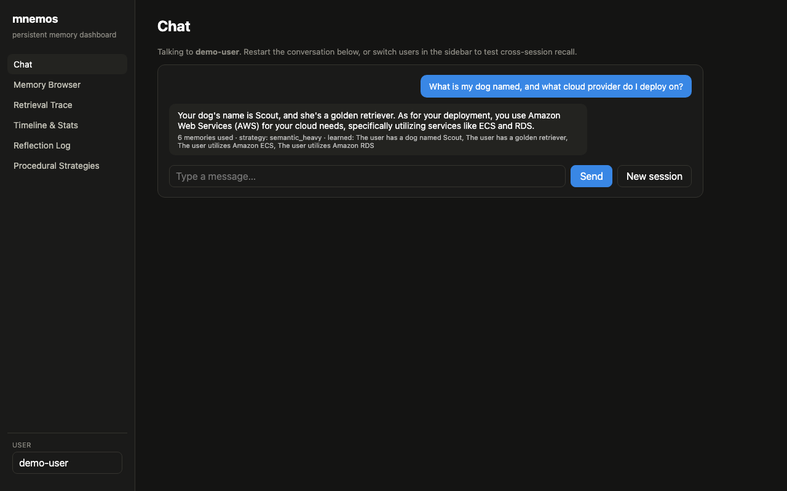
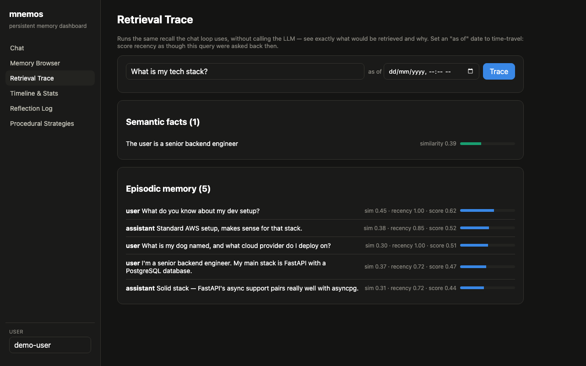
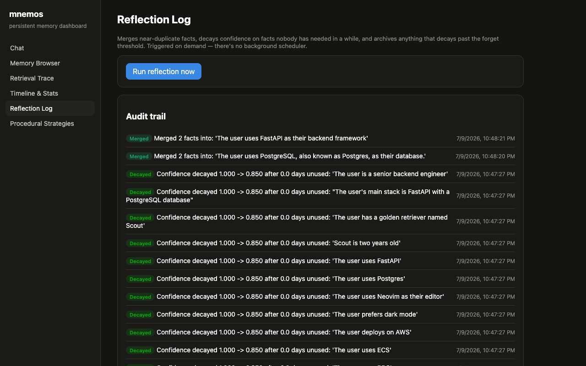
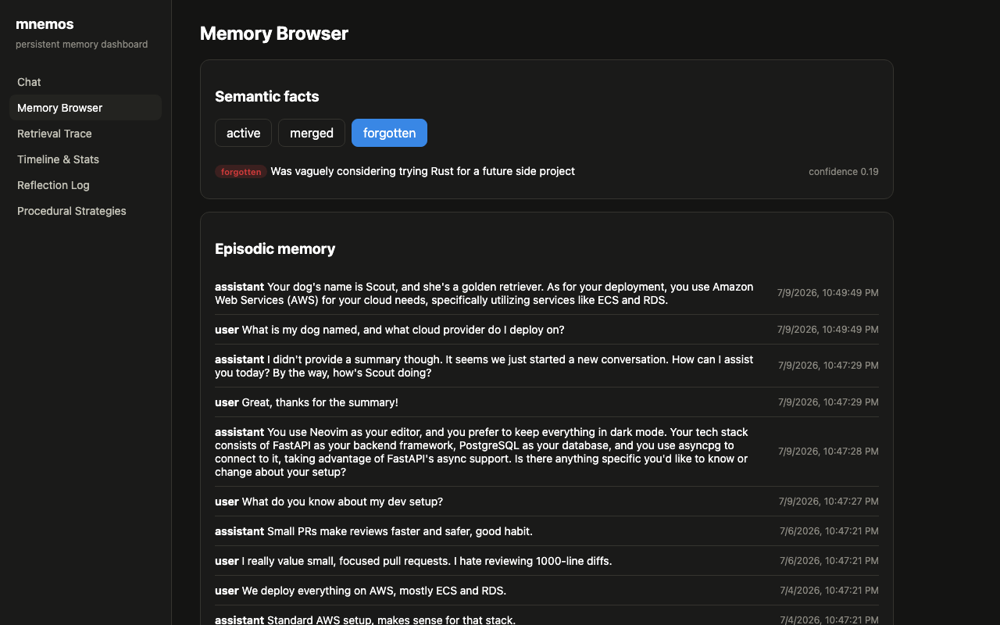
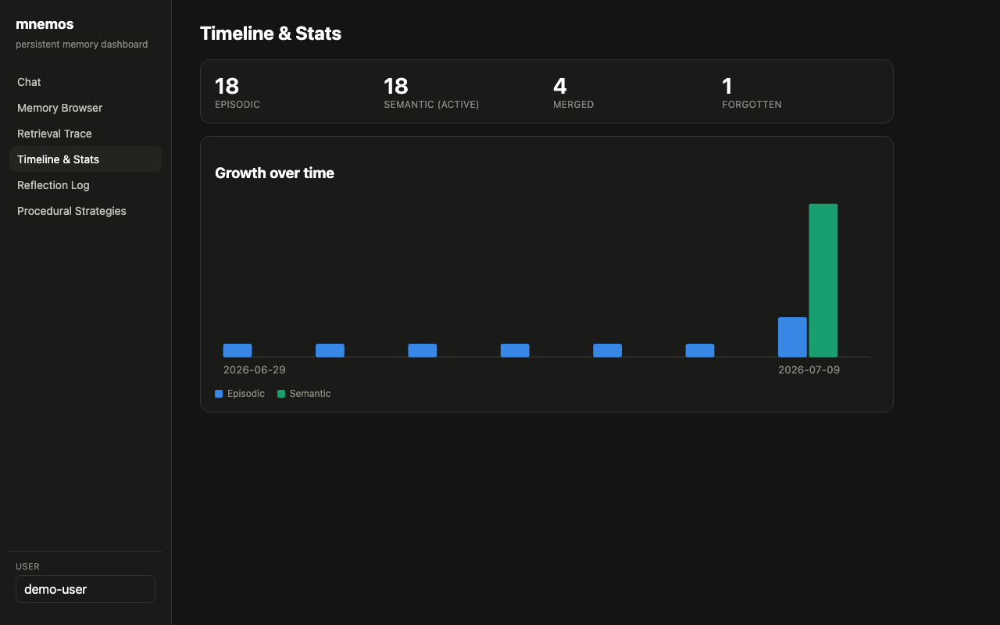
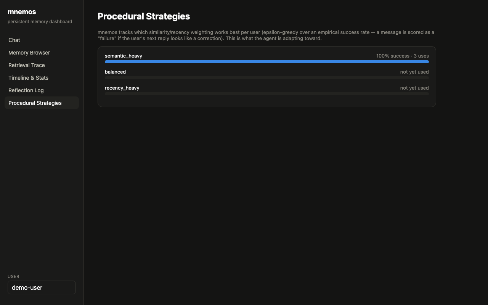
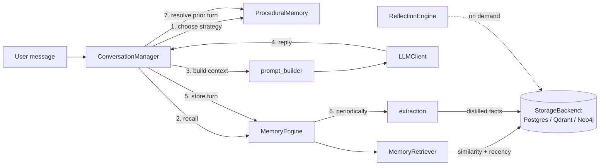

# mnemos

[](https://github.com/vishalbanwari26/mnemos/actions/workflows/ci.yml)

A persistent memory framework for LLM agents. It gives an agent episodic
memory (what was said, and when), semantic memory (distilled facts about the
user), procedural memory (which retrieval strategy actually works for this
user), and reflection (consolidating and forgetting facts over time) — backed
by a choice of three storage backends, exposed over a FastAPI surface, and
observable through a React dashboard. It ships with a benchmark that measures
whether the agent actually still remembers something 30 simulated days after
it was mentioned once — not just whether the demo looks good.

Most "agent memory" projects on GitHub are a vector store wrapped around a
chat loop with no way to tell if it's actually working. This one tries to
answer that question directly: seed a fact once, ask about it later, measure
recall and answer accuracy with and without memory, and report the delta.

## See it work

Recorded live, against a real running dashboard, a live Postgres backend, and
a real hosted LLM (Groq, Llama 3.3 70B) — not staged, not a mockup. Demo data
was seeded across 7 simulated conversation sessions spanning 10 simulated
days: a chat turn correctly recalls a fact from one earlier session (the
user's dog) and a different fact from another earlier session (the
deployment stack), then the walkthrough moves through retrieval scoring,
memory stats, and the reflection audit trail.

<p align="center"></p>

Static screenshots of each view, for anyone who wants to pause and read the
numbers:

**It actually remembers across sessions,** and shows exactly which memories
it used and what it just learned.

<p align="center"></p>

**Retrieval isn't a black box.** Every retrieved memory ships with its real
similarity, recency, and combined score — this is the actual ranking the
chat loop uses, not a simplified illustration.

<p align="center"></p>

That transparency isn't just a dashboard view here — it's now a standalone
library, [memlens](https://github.com/vishalbanwari26/memlens), that traces
retrieval for any backend (mem0, raw pgvector, or mnemos itself): every
candidate considered, its full score breakdown, and whether it was included
or excluded and why.

**The system prunes itself.** Reflection has merged 4 pairs of near-duplicate
facts into single consolidated statements (via real LLM tool-use calls) and
decayed stale facts' confidence; a low-value fact that crossed the forget
threshold is now archived, not silently deleted.

<p align="center"></p>
<p align="center"></p>

**It knows what's in memory, and how that's changing.** Counts by type and
status, plus a growth-over-time chart, computed from the same demo data: 18
episodic memories, 18 active facts, 4 merged, 1 forgotten.

<p align="center"></p>

**It adapts its own retrieval strategy.** After live turns, the system
already has empirical uses/success-rate data on which similarity/recency
weighting works best for this user — the mechanism, not a placeholder.

<p align="center"></p>

## Quickstart

```bash
git clone https://github.com/vishalbanwari26/mnemos && cd mnemos
cp .env.example .env   # fill in ANTHROPIC_API_KEY or GROQ_API_KEY + LLM_PROVIDER
docker compose up -d   # Postgres + pgvector
uv sync --extra dev
uv run alembic upgrade head
uv run python -m mnemos.cli.demo   # terminal chat; restart it to test cross-session recall
```

Not on PyPI yet, so `git clone` is the install for now. No Docker, want the
full HTTP API + dashboard, or want to try the Qdrant/Neo4j backends instead?
See [Running it](#running-it) below for all of that.

## Why this exists

Chat agents without persistent memory forget everything between sessions.
Ask ChatGPT-style tools about something you told them yesterday and, unless
it happened to land in a fixed context window, it's gone. The interesting
systems question isn't "can I bolt a vector DB onto an LLM" — it's *how do
you decide what to keep, how do you retrieve it cheaply and correctly, how
do you forget responsibly, how do you adapt your own retrieval strategy from
feedback, and how do you prove any of it is working over time, not just in a
single session.*

This project started as a deliberately scoped v1 — two memory types, one
storage backend, one retrieval strategy, a benchmark — to prove the core
loop actually works before building anything else on top of it. It then grew
into the full system: procedural memory, reflection/forgetting, three
interchangeable storage backends, and a dashboard. See
[What's intentionally out of scope](#whats-intentionally-out-of-scope) for
what's still not here, and why.

## Architecture



- **`MemoryEngine`** (`src/mnemos/memory/engine.py`) is the single seam
  everything else talks to. It wraps a `StorageBackend` and an
  `EmbeddingClient`. Nothing outside this file touches a backend or the
  retriever directly — that's what let procedural memory, reflection, and two
  extra storage backends get added later without rewiring every caller.
- **`ConversationManager`** (`src/mnemos/agent/conversation.py`) is the
  per-turn loop: pick a retrieval strategy → recall relevant memories →
  build a system prompt → call the LLM → store the new episode →
  periodically extract semantic facts → resolve the previous turn's
  strategy outcome. The CLI and the API both call the same
  `handle_message()`.
- **`LLMClient`** (`src/mnemos/llm/`) is a small provider-agnostic interface
  (`complete()` with optional tool use). Two real implementations —
  `AnthropicLLMClient` and `GroqLLMClient` (the latter translates the
  Anthropic-shaped tool schemas used throughout the app into OpenAI's format
  internally, since Groq's API is OpenAI-compatible) — plus `MockLLMClient`,
  deterministic and offline, used by every test and by `--llm mock` dev runs.
- **`EmbeddingClient`** (`src/mnemos/embeddings/`) is the same pattern for
  embeddings. Anthropic has no embeddings endpoint, so v1 defaults to a local
  `sentence-transformers` model (`all-MiniLM-L6-v2`) — free, deterministic,
  no second API key, and it keeps the benchmark reproducible without
  embedding-call cost or latency variance.

### Data model

Episodic and semantic memory live in whichever `StorageBackend` is active
(see below). Procedural memory and the reflection log are small operational
metadata that **always** live in Postgres, regardless of `STORAGE_BACKEND` —
they're not the "memory content" the backend comparison is about:

- **episodes** — one row/node/point per conversational turn. `occurred_at`
  is a *logical* event time, separate from `created_at` (real insert time).
  That's what lets the benchmark simulate 30 days passing without waiting 30
  days: seed data is inserted "now" but timestamped as if it happened weeks
  ago.
- **facts** — distilled facts ("prefers FastAPI over Flask"), extracted from
  episodes via an Anthropic tool-use call, deduplicated against existing
  facts by cosine similarity before being written. Each fact tracks
  `status` (`active` / `merged` / `forgotten`), `confidence`, and
  `last_reinforced_at` — the fields reflection and forgetting operate on.
- **`procedural_strategies`** (Postgres only) — per-user, per-strategy
  `uses`/`successes` counters.
- **`reflection_log`** (Postgres only) — audit trail of every merge/decay/
  forget action reflection has taken.

### Retrieval

A query (the latest user message, or a benchmark probe question) is embedded
and matched against both episodes and facts independently, then merged:

```
score = similarity * w_sim + recency_factor * w_recency   (episodic only)
score = similarity                                          (semantic facts)
recency_factor = exp(-age_days / 30)
```

`w_sim`/`w_recency` default to `0.7`/`0.3`, but aren't fixed — see
[Procedural memory](#procedural-memory) below for how they get chosen per
turn. Semantic facts are treated as durable knowledge and ranked mostly on
similarity; episodic turns get an exponential recency boost so recent
context still surfaces even when it's a slightly weaker semantic match.
Intentionally simple — a documented default, not a research contribution.

## Storage backends

Episodic and semantic memory sit behind a `StorageBackend` interface
(`src/mnemos/storage/base.py`) — nothing in `MemoryEngine`, `agent/`, or
`api/` knows which one is active. Three real implementations exist, selected
via `STORAGE_BACKEND=postgres|qdrant|neo4j`:

- **Postgres + pgvector** (default) — HNSW cosine similarity search.
- **Qdrant**, embedded local mode (`QdrantClient(path=...)`) — no server, no
  Docker, a single directory-locked process. Qdrant combines payload
  filtering (`user_id`) with ANN search in one query.
- **Neo4j** — a real graph, not a vector table wearing a costume: episodes
  and facts are nodes owned by a `User` via `SAID`/`KNOWS` edges, and a
  fact's provenance is a first-class `DERIVED_FROM` edge to its source
  episodes, instead of Postgres's `source_episode_ids` JSON array. Its
  native vector index has no pre-filter, so this backend over-fetches
  candidates and filters by `user_id` in Cypher afterward — a real,
  measurable cost, not hidden.

The same behavioral test suite (`tests/test_storage_contract.py`) runs
against all three, so "swap the backend" is proven, not just asserted. A
separate, LLM-free comparison script reuses the benchmark dataset to measure
write/search latency and confirm recall parity:

```bash
uv run python -m benchmark.compare_backends
```

| Backend | Write p50 / p95 (ms) | Search p50 / p95 (ms) | Recall@K |
|---|---|---|---|
| postgres | 14.9 / 28.8 | 14.5 / 25.1 | 100% |
| qdrant | 11.6 / 18.8 | 11.1 / 14.3 | 100% |
| neo4j | 28.5 / 46.2 | 20.5 / 22.1 | 100% |

All three retrieve the same relevant memories (100% recall on this dataset).
Qdrant is fastest — an embedded, in-process client has no network round
trip. Postgres is close behind. Neo4j is consistently slowest here: each
write also polls its vector index to confirm the new node is searchable
before returning (Neo4j's vector index updates asynchronously in the
background, unlike Postgres/Qdrant which are immediately consistent — this
poll is the only way to give this backend the same read-your-writes
guarantee the other two have for free), and its lack of native pre-filtering
adds Cypher-side filtering overhead on search. Reproduce this yourself with
the command above — numbers will vary with hardware, but the ranking has
been stable across repeated local runs.

## Procedural memory

The original brainstorm's idea of "procedural memory" (a multi-step task
workflow that improves over time) assumes an agent that executes multi-tool
procedures. mnemos is a memory-augmented chat loop, not a task-executing
agent, so bolting on a fake version of that would be dishonest. Instead,
procedural memory here tracks a real recurring decision the system actually
makes every turn: **which retrieval weighting works best for this specific
user.**

Three named strategies, different `(similarity_weight, recency_weight)`
pairs:

| Strategy | similarity | recency |
|---|---|---|
| `semantic_heavy` | 0.9 | 0.1 |
| `balanced` (v1 default) | 0.7 | 0.3 |
| `recency_heavy` | 0.4 | 0.6 |

Each turn, `ProceduralMemory.choose_strategy()` picks the empirically
best-performing strategy for that user (epsilon-greedy, `ε≈0.15` chance of
exploring another). The *outcome* is scored on the user's **next** message
in the same session: if it contains a correction cue ("no,", "that's
wrong", "actually,", ...), the previous turn's strategy is marked a failure;
otherwise a success. Crude, heuristic, and fully inspectable in
`src/mnemos/memory/procedural.py` — not a hidden metric. The dashboard's
Procedural Strategies view shows live uses/success-rate per strategy.

## Reflection and forgetting

One consolidation pass per user (`ReflectionEngine.run()`,
`src/mnemos/memory/reflection.py`), triggered on demand — CLI command or a
dashboard button, not a background scheduler, because there's no task queue
in this project and pretending otherwise would misrepresent what's actually
running:

1. **Merge** — active facts are greedily clustered by pairwise cosine
   similarity above a looser threshold than extraction's own dedup check;
   each multi-fact cluster becomes one Anthropic tool-use call that produces
   a single consolidated statement, written with the union of the cluster's
   source episodes, while the originals are marked `status="merged"` (soft —
   never hard-deleted, so there's always an audit trail).
2. **Decay** — any fact whose `last_reinforced_at` is older than
   `REFLECTION_DECAY_DAYS` has its confidence multiplied by
   `REFLECTION_DECAY_FACTOR`.
3. **Forget** — a fact whose confidence drops below
   `REFLECTION_FORGET_CONFIDENCE_THRESHOLD` becomes `status="forgotten"`
   (still soft — visible in the Memory Browser's "forgotten" filter).

Every action writes a `reflection_log` row — the dashboard's Reflection Log
view is that table, verbatim. **Reinforcement** is the inverse of decay:
`MemoryEngine.recall()` bumps `last_reinforced_at` (and nudges confidence up
slightly, capped at 1.0) for every fact that actually makes it into a
retrieval result — facts you keep needing survive, facts nobody asks about
fade, implemented rather than narrated.

"Memory compression" and "dreaming" from the original brainstorm aren't
separate features — compression is literally the merge step above, and
"dreaming" would just be this same pass on a timer, which is exactly what
the on-demand framing is honest about not having.

```bash
uv run python -m mnemos.cli.reflect --user demo-user
```

## Time travel

`MemoryEngine.recall(..., now=<a past datetime>)` scores recency as though
the query were asked at that point in simulated time — this already existed
to make the benchmark's 30-day-gap questions work. The dashboard's Retrieval
Trace view exposes the same parameter as an "as of" date picker: pick a past
date, see exactly what would have been retrieved and why, with per-item
similarity/recency/score. Not a separate subsystem — the same mechanism, a
UI on top of it.

## Dashboard

`dashboard/` — React 19 + Vite + TypeScript, talking to the FastAPI backend
over HTTP (`@tanstack/react-query`, `react-router`). Six views:

- **Chat** — the product itself, not just an inspector.
- **Memory Browser** — episodic list + semantic facts filterable by
  active/merged/forgotten.
- **Retrieval Trace** — type a query (+ optional "as of" date for time
  travel), see the ranked result with per-item similarity/recency/score.
- **Timeline & Stats** — episodic/semantic/merged/forgotten counts and a
  growth-over-time chart.
- **Reflection Log** — audit trail + a "run reflection now" button.
- **Procedural Strategies** — live uses/success-rate per strategy.

```bash
uv run uvicorn mnemos.api.main:app --port 8000   # backend, one terminal
cd dashboard && npm install && npm run dev        # frontend, another terminal
```

Then open the Vite dev URL (`http://localhost:5173` by default). The backend
must run on port 8000 to match `dashboard/.env`'s `VITE_API_BASE_URL` and
the CORS origin configured in `src/mnemos/api/main.py`.

## The benchmark

`benchmark/run_benchmark.py` is the credibility check: it seeds 18 synthetic
conversations across simulated days 0–18, each mentioning exactly one fact
about a fictional user, then asks 18 probe questions later — some same-day,
some a week later, some 30 days later — and compares two conditions:

- **With memory**: the normal retrieve → build context → answer path.
- **No memory**: the same question, same LLM, empty context (a stateless
  baseline).

It scores two things: **retrieval recall@K** (did the relevant fact or
episode actually get retrieved — isolates the memory engine from the LLM's
phrasing) and **answer accuracy** (keyword match against the generated
reply — the end-to-end number), both broken down by how much simulated time
had passed. It also records latency (p50/p95) and token usage/estimated
cost.

```bash
uv run python -m benchmark.run_benchmark --llm anthropic   # the real, reported number
uv run python -m benchmark.run_benchmark --llm groq         # same, on a Groq-hosted model
uv run python -m benchmark.run_benchmark --llm mock         # fast offline smoke test of the harness only
```

`--llm mock` proves the plumbing works (seeding, simulated time, scoring,
report generation) but the mock client ignores its context entirely, so its
accuracy numbers are meaningless by construction — that run is for verifying
the harness, never for reporting a result. The `--llm anthropic`/`--llm groq`
runs are the ones that produce a real with-memory-vs-no-memory delta; they
require `ANTHROPIC_API_KEY`/`GROQ_API_KEY` respectively and aren't included
in this repo's history because they cost real API calls to generate — run
one yourself and the result lands in `benchmark/results/`.

## Running it

```bash
cp .env.example .env   # fill in ANTHROPIC_API_KEY or GROQ_API_KEY + LLM_PROVIDER

# Postgres + pgvector, via Docker...
docker compose up -d
# ...or a local install (see below if you don't have Docker)

uv sync --extra dev
uv run alembic upgrade head
uv run pytest                                    # unit tests: instant, fully offline
uv run python -m mnemos.cli.demo                 # terminal chat; restart it to test cross-session recall
uv run python -m mnemos.cli.reflect --user demo-user   # manual reflection pass
uv run uvicorn mnemos.api.main:app --port 8000   # full HTTP API (needed for the dashboard)
uv run python -m benchmark.run_benchmark --llm anthropic
```

Without Docker, install Postgres 16+ and pgvector locally (e.g. on macOS,
`brew install postgresql@17 pgvector`, since Homebrew's pgvector bottle
targets newer Postgres major versions than 16), create a `mnemos` role/db,
`CREATE EXTENSION vector;` as a superuser, and point `DATABASE_URL` in
`.env` at it. Integration tests default to spinning up an ephemeral
Postgres+pgvector via `testcontainers` (works out of the box in CI); without
Docker locally, set `MNEMOS_TEST_DATABASE_URL` to a scratch database instead
and they'll use that.

Postgres is the default backend (`STORAGE_BACKEND=postgres`, or unset). To
try Qdrant, no setup is needed — it runs embedded (set `STORAGE_BACKEND=qdrant`
in `.env` or the environment). For Neo4j: `brew install neo4j`,
`neo4j-admin dbms set-initial-password <password>` before first start,
`brew services start neo4j`, then set `STORAGE_BACKEND=neo4j` and
`NEO4J_PASSWORD` to match.

### API surface

```
POST   /users/{user_id}/messages                chat turn (choose strategy -> recall -> LLM -> store -> maybe extract -> resolve prior turn)
GET    /users/{user_id}/memories/episodic        list stored turns
GET    /users/{user_id}/memories/semantic        list facts (?status=active|merged|forgotten)
DELETE /users/{user_id}/memories/semantic/{id}   explicit forgetting of one fact
POST   /users/{user_id}/reset                    wipe a user's memory
POST   /users/{user_id}/seed                     write pre-scripted turns (used by the benchmark)
POST   /users/{user_id}/retrieval-trace          run recall() without calling the LLM; ?as_of= for time travel
GET    /users/{user_id}/stats                    counts by type/status + growth-over-time buckets
POST   /users/{user_id}/reflect                  run a reflection pass now
GET    /users/{user_id}/reflection-log           audit trail of merge/decay/forget actions
GET    /users/{user_id}/procedural                per-strategy uses/success-rate
```

## Tests

```bash
uv run pytest                 # unit tests (mocked LLM/embeddings where the test isn't about real quality)
uv run pytest tests/unit/test_retrieval.py  # runs against real local embeddings, not mocks —
                                              # the point of that file is proving semantic ranking works
```

61 tests total: the storage backend-contract suite (11 behavioral tests ×
3 backends), retrieval ranking (real embeddings), extraction + dedup,
procedural strategy selection/outcome-scoring, reflection merge/decay/
forget/reinforce, the conversation loop, the full HTTP API via
`httpx.AsyncClient`, and benchmark scoring logic. Neo4j's contract tests
skip gracefully if no local instance is reachable rather than failing the
suite.

## What's intentionally out of scope

A few things stayed out on purpose, to keep every feature above honestly and
fully implemented rather than half-built:

- **Two real LLM providers** (Anthropic, Groq) plus a mock — the `LLMClient`
  interface supports adding OpenAI/Gemini/local models later without
  touching agent or memory code, but a third real client isn't built.
- **No background scheduler** — reflection runs on demand (CLI/dashboard),
  not on a timer. Adding one is an infra decision (cron, a task queue)
  orthogonal to the memory logic itself.
- **Heuristic-only signals** — procedural memory's "success" signal
  (correction-cue keyword matching) and reflection's clustering/decay
  thresholds are documented defaults, not tuned or validated against a
  labeled dataset. They're real and inspectable, not research-grade.

## License

MIT
